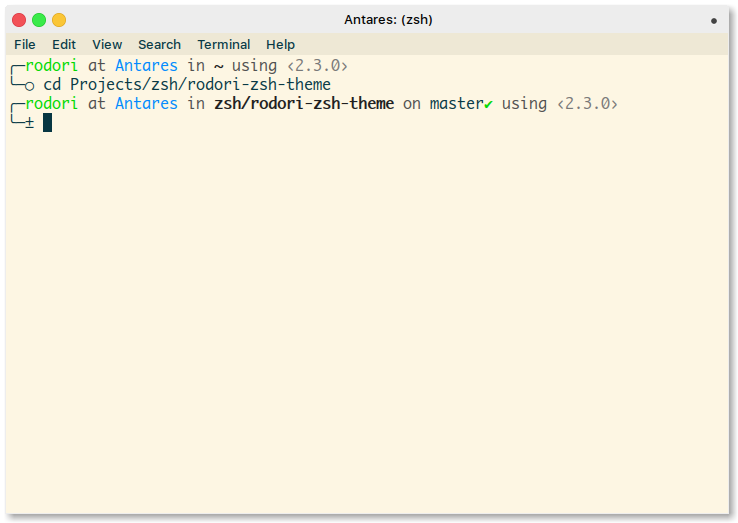
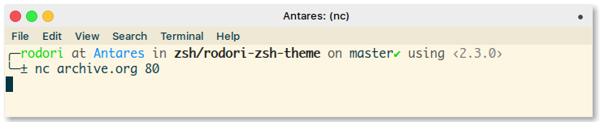
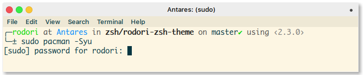

## Rodori ZSH Theme

I think you're going to love this one, it's an extension of
`fino.zsh-theme`, standard on every Oh My Zsh installation.

## Screenshots

## License

**COPY** - **SHARE** - **ENJOY**
